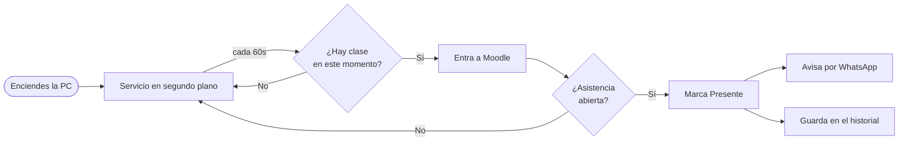

# Attendance Assistant

> Marca tu asistencia en **UAM Virtual (Moodle)** de forma automática, te avisa por **WhatsApp** cuando lo hace, y corre solo en segundo plano cada vez que enciendes la PC.

<p align="center">
  
  
  
  
</p>

---

## ¿Qué hace?

Cuando llega la hora de una clase de tu horario, el asistente entra a Moodle, revisa si el profesor abrió el pase de asistencia y, si está abierto, marca **"Presente"** por ti. Luego te manda un mensaje de WhatsApp para que sepas que ya quedó, sin que tengas que abrir nada.



## Inicio rápido

```powershell
# 1. Entorno e instalación (una sola vez)
python -m venv .venv
.\.venv\Scripts\Activate.ps1
pip install -r requirements.txt
python -m playwright install chromium

# 2. Configura tus datos y tu horario
.\gabo.cmd config                       # credenciales UAM + WhatsApp
.\gabo.cmd schedule "C:\ruta\horario.json"
.\gabo.cmd whatsapp                     # escanea el QR una vez

# 3. Deja que arranque solo al iniciar Windows
powershell -ExecutionPolicy Bypass -File scripts\install_autostart.ps1

# 4. (Opcional) arráncalo ahora mismo sin reiniciar
.\gabo.cmd start
```

## Comandos

| Comando | Qué hace |
| --- | --- |
| `gabo config` | Configura credenciales UAM y WhatsApp (crea/edita el `.env`). |
| `gabo schedule <archivo.json>` | Carga tu horario en el proyecto. |
| `gabo whatsapp` | Vincula WhatsApp Web escaneando el QR (una sola vez). |
| `gabo start` / `gabo stop` | Inicia / detiene el bot en segundo plano. |
| `gabo status` | Dice si el bot está activo. |
| `gabo check-now` | Revisa Moodle una sola vez, ahora mismo (para probar). |
| `gabo run` | Igual que el servicio, pero en primer plano (para depurar). |
| `gabo log` | Muestra el historial reciente de asistencias. |

> En Windows usa `gabo.cmd`; en Linux/macOS o Git Bash usa `./gabo`.

## Documentación

- **[Guía de instalación y uso](docs/setup.md)** — paso a paso completo.
- **[Cómo funciona por dentro](docs/arquitectura.md)** — la lógica de cada parte del proyecto.

## Aviso

Este proyecto automatiza tu propia cuenta con tus credenciales. Depende del HTML actual de UAM Virtual: si Moodle cambia, puede requerir ajustes. Úsalo con criterio y responsabilidad.
