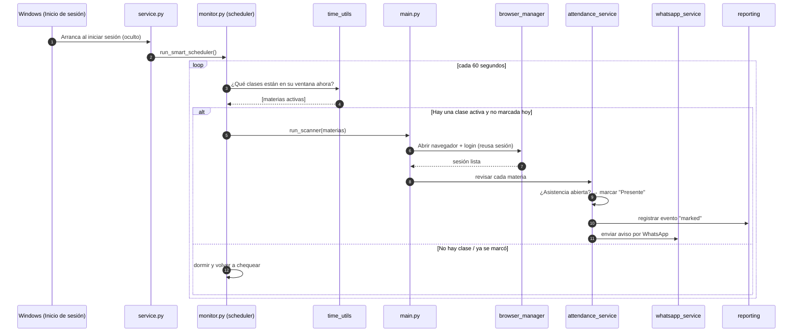

# Cómo funciona por dentro

Este documento explica la **lógica de cada parte** del proyecto: qué hace, por qué existe y cómo se conectan entre sí.

---

## Alcance del proyecto

El proyecto se mantiene **enfocado en su objetivo real**: marcar asistencia, avisar y correr solo.

**Lo que hace:**

- Marcado automático de asistencia en Moodle.
- Aviso por WhatsApp, tanto al marcar como al fallar.
- Ejecución en segundo plano al iniciar Windows.
- Control por CLI (`gabo`) e historial simple de eventos.

### Funciones que se consideraron y se descartaron

Durante el desarrollo se llegaron a construir o intentar varias funciones que finalmente se quitaron, para no cargar el proyecto con código que no aportaba al objetivo:

| Función | Por qué se descartó |
| --- | --- |
| **Interfaz gráfica de escritorio** | Se llegó a construir, pero obligaba a abrir una ventana y darle a un botón, lo que contradice el objetivo de correr invisible en segundo plano. El autoarranque + la CLI lo cubren mejor. |
| **Dashboard web + capturas de pantalla** | Duplicaba lo que ya confirma el aviso de WhatsApp, a cambio de mucho más código que mantener (servidor HTTP, cálculo de porcentajes, limpieza de carpetas). |
| **Lectura del horario desde PDF/imagen** | Se intentó, pero el parseo salía deforme e inconsistente. El JSON exportado es fiable y solo se carga una vez por semestre. |
| **Instalación en el PATH del sistema** (`install-command`) | Un lujo innecesario para una herramienta de un solo usuario en su propia máquina. |

Todo se controla con la **CLI** y el **autoarranque**; no hay ventanas ni servidores que mantener.

---

## Estructura del código

```
attendance-assintant/
├─ gabo / gabo.cmd            # Lanzadores de la CLI (Unix / Windows)
├─ scripts/
│  ├─ bootstrap.ps1           # Instalación automática (entorno + dependencias)
│  ├─ service.py              # Punto de entrada en segundo plano (pythonw)
│  ├─ install_autostart.ps1   # Instala el arranque al iniciar sesión
│  └─ uninstall_autostart.ps1 # Lo quita
└─ src/attendance_assistant/
   ├─ cli.py                  # Todos los comandos (config, start, log, …)
   ├─ main.py                 # Un "barrido" completo de Moodle
   ├─ config/settings.py      # Configuración central (.env, rutas)
   ├─ core/
   │  ├─ logger.py            # Bitácora (consola + archivo)
   │  ├─ reporting.py         # Historial de eventos (JSON)
   │  ├─ models.py            # Modelos de datos (pydantic)
   │  └─ exceptions.py        # Errores propios
   ├─ browser/
   │  ├─ browser_manager.py   # Ciclo de vida de Playwright + sesión
   │  └─ selectors.py         # Selectores del DOM, centralizados
   ├─ auth/login_service.py   # Login / reutilización de sesión
   ├─ courses/course_service.py   # Lista de materias matriculadas
   ├─ attendance/attendance_service.py  # El corazón: marca la asistencia
   ├─ whatsapp/
   │  ├─ whatsapp_service.py  # Envía el mensaje
   │  └─ setup_whatsapp.py    # Vincula el QR (una vez)
   ├─ scheduler/monitor.py    # El reloj: decide cuándo actuar
   ├─ utils/time_utils.py     # Lee el horario y calcula ventanas activas
   └─ storage/horario.json    # Tu horario
```

---

## El flujo completo



---

## La lógica de cada parte

### `scheduler/monitor.py` — el reloj
Es el proceso que vive todo el día. Cada **60 segundos** (`HEARTBEAT_SECONDS`):
1. Pregunta al horario qué materias están en su **ventana de asistencia** ahora mismo.
2. Descarta las que **ya marcó hoy** (memoria en RAM `completed_today`, que se reinicia al cambiar de día).
3. Si queda alguna pendiente, lanza un barrido (`main.py`) apuntando solo a esas materias.
4. Guarda su **PID** en `state/` al arrancar para que `gabo status`/`stop` puedan encontrarlo.

> Solo abre el navegador cuando hay algo que hacer. El resto del tiempo apenas consume recursos.

### `utils/time_utils.py` — el cálculo de la ventana
`get_active_classes()` compara la hora del sistema con cada evento del horario del **día actual** (`day` = 0 para lunes). La ventana de cada clase es:

```
apertura = hora_inicio − 10 min      cierre = hora_fin + 15 min
```

La ventana se mantiene abierta **durante toda la clase** (no solo al inicio): algunos profesores abren la asistencia tarde, así que el bot sigue revisando cada 60 s hasta que la marca o hasta que la clase termina. Si "ahora" cae dentro de ese rango, la materia se considera **activa**. `load_schedule()` lee el JSON con tolerancia a fallos (archivo vacío, BOM de Windows, JSON corrupto).

### `browser/browser_manager.py` — el navegador
Controla el ciclo de vida de Playwright/Chromium. Su truco clave: **reutiliza la sesión** guardada en `state/state.json`, así no tiene que loguearse desde cero cada vez. Aplica un "disfraz" (user-agent y viewport realistas) y respeta `HEADLESS_MODE`.

### `auth/login_service.py` — el login
Primero verifica si la sesión guardada **sigue viva** (¿ya estamos en el dashboard?). Si no, ingresa usuario y contraseña. Lanza `MoodleAuthError` si las credenciales fallan.

### `courses/course_service.py` — las materias
Lee del dashboard la lista de asignaturas matriculadas (nombre + enlace), sin duplicados.

### `attendance/attendance_service.py` — el corazón
Para cada materia:
1. Entra al curso y busca el **módulo de asistencia**.
2. Si hay una sesión de asistencia **abierta**, hace clic en el enlace, selecciona **"Presente"** y guarda.
3. Registra el evento en el historial y **dispara el WhatsApp**.

Detalles importantes:
- **Reintentos:** hasta 3 intentos con espera aleatoria de 5–10 s si Moodle falla o va lento.
- **"Humanización":** pausas aleatorias entre clics para no parecer un robot instantáneo.
- Si no encuentra la etiqueta "Presente", cae a un radio por defecto.

### `whatsapp/whatsapp_service.py` — el aviso
Envía el mensaje usando **WhatsApp Web** con un perfil de navegador persistente (`state/wa_profile/`), autenticado una sola vez por QR con `setup_whatsapp.py`. No usa APIs de pago.

### `core/reporting.py` — el historial
Un registro **liviano** en `state/attendance_report.json`: cada asistencia marcada (`marked`) o ventana revisada sin éxito (`not_available`) queda anotada con fecha, hora y materia. Lo consulta `gabo log`. No toma capturas ni levanta servidores.

### `cli.py` — el panel de control
La única superficie de control. Traduce cada comando (`config`, `schedule`, `whatsapp`, `start`, `stop`, `status`, `run`, `check-now`, `log`) a la función correspondiente. Gestiona el arranque/paro del proceso en segundo plano vía el archivo PID.

### `scripts/service.py` + `install_autostart.ps1` — el autoarranque
`service.py` es el entrypoint que corre el scheduler sin ninguna ventana (se lanza con `pythonw.exe`). `install_autostart.ps1` crea un **acceso directo en la carpeta de Inicio** de Windows que lo ejecuta al iniciar sesión — **sin permisos de administrador**.

---

## Decisiones de diseño (el "por qué")

| Decisión | Razón |
| --- | --- |
| **Reutilizar la sesión** (`state.json`) | Menos logins = menos fricción y menos sospecha de automatización. |
| **Chequear cada 60 s durante toda la clase** | Así no se pierde la asistencia aunque el profe la abra tarde; fuera del horario de clase el bot no abre el navegador. |
| **Selectores centralizados** (`selectors.py`) | Si Moodle cambia el HTML, se arregla en un solo lugar. |
| **Autoarranque por carpeta de Inicio** | La cuenta de Windows suele ser estándar (sin admin); este método no lo requiere. |
| **Historial en JSON simple, sin dashboard** | El aviso de WhatsApp ya confirma en el momento; el historial es solo respaldo. |
| **`pythonw.exe` en segundo plano** | Corre sin abrir ninguna consola ni ventana. |

---

## Riesgos conocidos

- **Moodle puede cambiar su HTML** y romper los selectores sin aviso → ajustar `selectors.py`.
- **WhatsApp Web puede pedir re-vincular** si el teléfono se desconecta mucho tiempo → volver a correr `gabo whatsapp`.
- **El marcado depende del reloj del sistema**: si la hora de Windows está mal, las ventanas no coincidirán.
- **Automatizar una cuenta institucional** conlleva responsabilidad de uso; queda a criterio del usuario.
