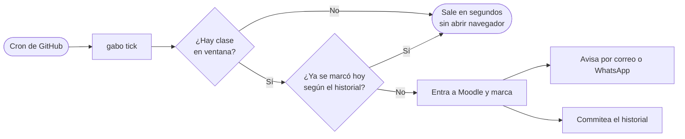

# Modo nube: GitHub Actions

Guía para que el bot marque tu asistencia **aunque tu PC esté apagada**.

El servicio de Windows sigue igual: esto es un **respaldo** que corre en los
servidores de GitHub. Los dos pueden estar activos a la vez sin chocar, porque
Moodle es el que manda: si la asistencia ya está enviada, el enlace de envío
desaparece y la pasada en la nube simplemente no encuentra nada que hacer.



---

## 1. Qué cambia respecto al modo local

| | En tu PC | En GitHub Actions |
| --- | --- | --- |
| **Ejecución** | Un proceso vivo todo el día (`monitor.py`, latido de 60 s) | Una pasada por invocación (`gabo tick`), el runner se apaga al terminar |
| **Cuándo corre** | Siempre que la PC esté encendida | Solo en los `cron` generados desde tu horario |
| **Memoria de lo marcado** | En RAM (`completed_today`) | En el historial versionado (`history/attendance_report.json`) |
| **Hora** | La de Windows | UTC → por eso `APP_TIMEZONE` es obligatorio |
| **Aviso** | WhatsApp Web (perfil vinculado por QR) | Correo por Gmail (recomendado) o CallMeBot; WhatsApp Web **no** funciona ahí |

---

## 2. Preparativos (una sola vez)

### a) Sube tu horario al repositorio

GitHub necesita el horario para dos cosas: saber cuándo hay clase y generar los
`cron`. No contiene nada sensible (materias y horas), y el `.gitignore` ya tiene
la excepción para dejarlo pasar.

```bash
git add -f src/attendance_assistant/storage/horario.json
```

### b) Genera los horarios de los workflows

```bash
gabo workflow
```

Lee tu `horario.json`, calcula cada ventana (`inicio-10min` → `fin+15min`), la
convierte de Managua a **UTC** y escribe los `cron` en dos archivos:

- **`asistencia.yml`** — una expresión por cada ventana de clase.
- **`chequeo-login.yml`** — una sola, el domingo en la noche (ver §6).

Vuelve a ejecutarlo cada vez que cambies de horario o de fechas de semestre.

Por defecto revisa **cada 10 minutos** dentro de cada ventana: el `cron` de
GitHub ya se retrasa más que eso, así que bajar a 5 duplicaría las ejecuciones
sin ganar cobertura real. Si aun así lo quieres más fino, usa `--paso 5`.

Si configuraste las fechas del semestre, el generador además limita los `cron`
a los meses que abarca (`* 8-12 *`), para no levantar runners el resto del año.

### c) Configura los secretos del repositorio

En **Settings → Secrets and variables → Actions → New repository secret**:

| Secreto | Obligatorio | Valor |
| --- | --- | --- |
| `UAM_USERNAME` | Sí | Tu usuario de UAM Virtual |
| `UAM_PASSWORD` | Sí | Tu contraseña de UAM Virtual |
| `EMAIL_ADDRESS` | Solo si quieres avisos por correo (recomendado) | Tu dirección de Gmail |
| `EMAIL_APP_PASSWORD` | Solo si quieres avisos por correo | Ver §d) |
| `EMAIL_TO` | No | A quién le llega el aviso; si lo dejas vacío, `EMAIL_ADDRESS` se lo manda a sí mismo |
| `CALLMEBOT_PHONE` | Solo si prefieres CallMeBot en vez de correo | Tu número con código de país, sin `+` (ej. `50588887777`) |
| `CALLMEBOT_APIKEY` | Solo si prefieres CallMeBot | La API key que te da CallMeBot |

Por defecto el canal es `email`. Si prefieres CallMeBot en su lugar, o no
recibir avisos desde la nube, crea la **variable** (no secreto) `NOTIFIER` con
el valor `callmebot` o `none` respectivamente.

Las fechas del semestre viajan en el propio workflow
(`SEMESTER_START` / `SEMESTER_END`). Para cambiarlas sin editar el archivo,
crea variables del repositorio con esos mismos nombres.

### d) Da de alta el correo (gratis, una sola vez, recomendado)

WhatsApp Web no puede correr en un runner: depende del perfil de navegador que
vinculaste por QR, que vive solo en tu disco. El correo lo sustituye sin
depender de ningún servicio de terceros — es tu propia cuenta de Gmail
hablándole a sí misma por SMTP:

1. Activa la **verificación en 2 pasos** en tu cuenta de Google (si no la
   tienes ya): [myaccount.google.com/security](https://myaccount.google.com/security).
2. Ve a [myaccount.google.com/apppasswords](https://myaccount.google.com/apppasswords)
   y genera una **contraseña de aplicación** para "Correo".
3. Ese código de 16 caracteres va en `EMAIL_APP_PASSWORD` — **no** es tu
   contraseña normal de Gmail, esa no funciona aquí.

### e) Alternativa: CallMeBot (WhatsApp, gratis, pero puede fallar)

Si prefieres recibir el aviso por WhatsApp en vez de correo, o quieres tener
ambos activos, CallMeBot funciona igual con una petición HTTP:

1. Agenda el número **+34 621 331 709** en tu teléfono.
2. Mándale por WhatsApp: `I allow callmebot to send me messages`
3. Te responde con tu **API key** → va en `CALLMEBOT_APIKEY`.

> Es un servicio gratuito de un solo desarrollador: a veces tarda en responder
> el alta, o el servicio queda caído varios días. No depende de nada de este
> proyecto — si te falla, el correo es el respaldo pensado para eso, y el bot
> sigue marcando la asistencia igual aunque ningún aviso salga.

### f) Sube todo

```bash
git add .github/workflows/ history/.gitkeep
git commit -m "feat: respaldo de asistencia en GitHub Actions"
git push
```

---

## 3. Sesión reutilizada entre ejecuciones

A diferencia de tu PC (que reutiliza `state/state.json` para no loguear cada
vez), en la nube cada ejecución partía de cero por defecto. Ahora el workflow
cachea esa sesión con `actions/cache`: si el login de la corrida anterior
sigue vivo, la siguiente lo reutiliza en vez de hacer login completo. Esto es
un caché de **GitHub Actions**, no un commit al repositorio — no aparece en el
historial de git ni es visible navegando el repo público, aunque sea público.
Aun así, cada tanto Moodle expira la sesión y el bot hace login normal:
no requiere que hagas nada.

## 4. Chequeo de login el domingo en la noche

Para no enterarte de un problema de credenciales hasta que ya empezaron las
clases, hay un segundo workflow —**`chequeo-login.yml`**— que corre el
**domingo a las 20:00 (hora de Managua)** y solo intenta iniciar sesión, sin
marcar nada. Si falla, avisa por el canal configurado (`NOTIFIER`) con tiempo
de sobra para arreglarlo con `gabo config`. Si el login funciona, no manda
nada — no hace falta confirmar cada semana que va bien.

> Ojo con la hora si miras el archivo generado: "domingo 20:00 en Managua" cae,
> al convertir a UTC (Managua es UTC-6), en la madrugada del **lunes**. El
> cron trae día `1`, no `0` — es el mismo desfase que empuja las ventanas de
> clase de la tarde hacia el día siguiente en UTC. `gabo workflow` hace esa
> cuenta por ti; no hay que tocarla a mano.

## 5. Probar sin esperar a una clase

En **Actions → Asistencia UAM → Run workflow**, marca la casilla
`force_all` para que revise todas las materias ignorando el horario. Es el
equivalente en la nube de `gabo check-now`.

Para probar la misma lógica en tu PC:

```bash
gabo tick --all
```

---

## 6. Cómo leer los resultados

- **Historial:** el workflow commitea `history/attendance_report.json` después
  de cada pasada. Ahí queda cada `marked`, `not_available` y `error`.
  (`gabo log` lee el historial **local**, en `state/`; son dos registros
  distintos a propósito, para que el bot local no ensucie el repo.)
- **Job en rojo:** significa que había clase y el escaneo falló. El log completo
  queda como artefacto durante 7 días.
- **Códigos de salida de `gabo tick`:** `0` todo bien (marcó o no había nada),
  `1` había clase y falló el escaneo, `2` falta configuración.
- **Avisos por el canal configurado, no solo el historial:** si falla el
  escaneo de una materia, si falta configuración (credenciales u horario), o
  si algo se rompe antes de llegar a Moodle (dependencias, Chromium, el commit
  del historial), cada caso manda su propio aviso — deduplicado a una vez por
  día para no llenarte la bandeja si el problema persiste toda la jornada. El
  aviso de "algo se rompió fuera del escaneo" intenta por CallMeBot **y** por
  correo a la vez (los que tengan secretos configurados), para no depender de
  un solo canal justo cuando algo ya salió mal.

---

## 7. Límites que conviene tener presentes

| Límite | Qué significa para ti |
| --- | --- |
| **El `cron` de GitHub no es puntual** | Puede retrasarse de 5 a 30+ minutos en horas pico. Por eso la ventana cubre toda la clase y no solo el inicio. |
| **Los workflows programados se desactivan tras 60 días sin actividad** | El commit del historial cuenta como actividad, así que mientras tengas clases se mantiene vivo solo. |
| **Repositorio público = minutos gratis** | Si lo pasas a privado, el plan gratuito da 2000 min/mes: usa `--paso 10` o revisa el número de `cron`. |
| **Login desde una IP de datacenter** | Cada pasada inicia sesión desde un servidor de GitHub (no desde tu casa). Es el cambio más visible frente a UAM Virtual; si notas bloqueos, baja la frecuencia o quédate con el modo local. |
| **Las cookies nunca se suben** | `state/state.json` sigue en `.gitignore`: son una sesión válida de tu cuenta y en un repo público equivaldrían a regalar el acceso. |
